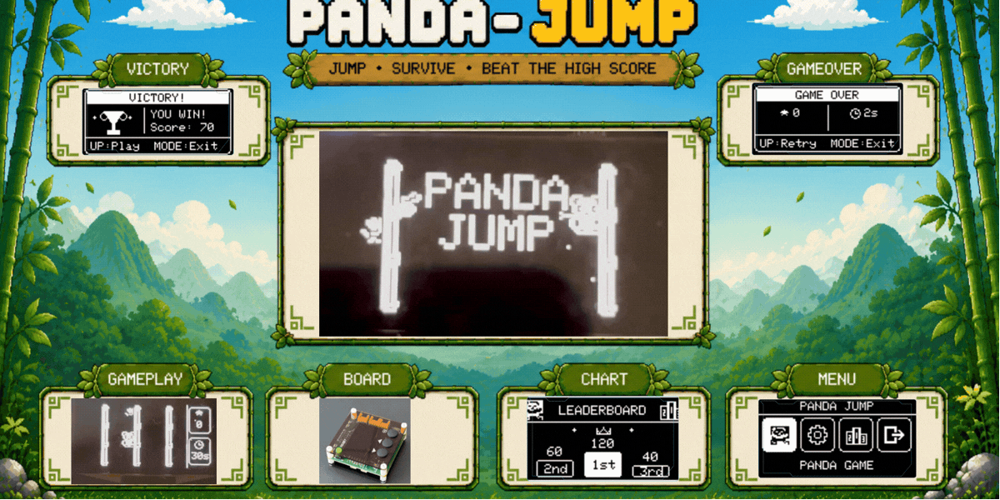
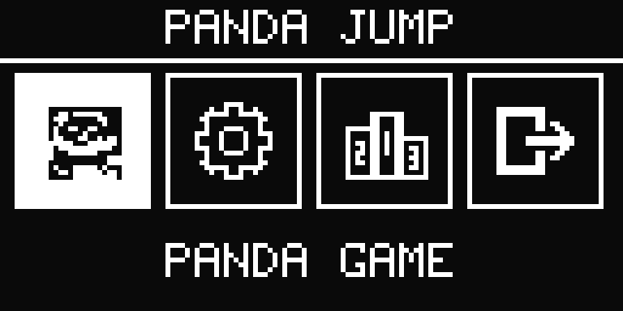
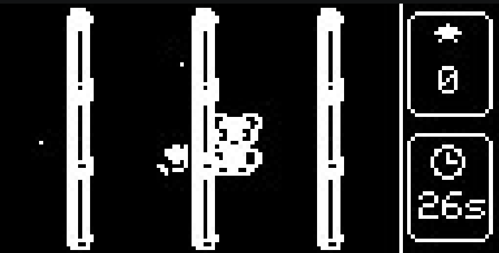
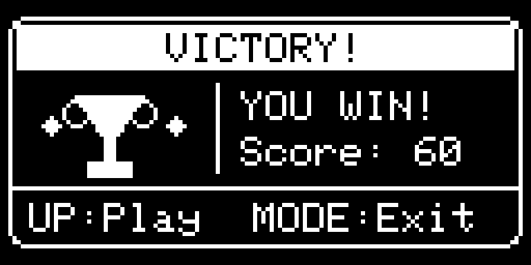
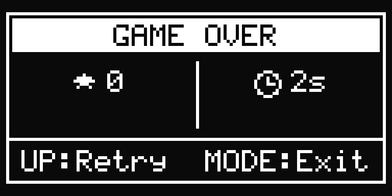
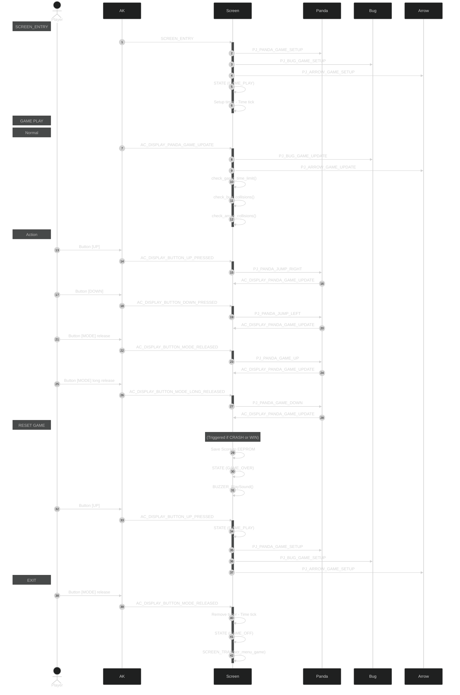

<div align="center">


<br>


</div>

# Panda Jump Game - built on AK Embedded Base Kit

<center>

</center>

<hr>

## Gameplay Demo

<div align="center">
  <video src="https://github.com/user-attachments/assets/15f762e3-c09b-4d8f-a86d-8436492189a4" controls width="480"></video>
</div>

## Documentation

| File | Description |
|---|---|
| [README.md](README.md) | Project overview, hardware specs, game mechanics, and object descriptions. |
| [docs/01-guide-getting-started.md](docs/01-guide-getting-started.md) | Guide to creating your fork, setting up the environment, and pushing code. |
| [docs/02-design-sequence-object.md](docs/02-design-sequence-object.md) | Sequence logic for each game object (Panda, Bug, Arrow) and collision flow. |
| [docs/03-design-sequence-runtime.md](docs/03-design-sequence-runtime.md) | Detailed runtime signal processing and interaction sequences. |
| [docs/04-eeprom-data-storage.md](docs/04-eeprom-data-storage.md) | Details on EEPROM memory map, checksum validation, and data persistence. |

## Introduction

Panda Jump is a **vertical time-attack climbing game** built on the **AK Embedded Base Kit**, powered by the **Active Kernel (AK)** event-driven framework. The player controls a panda gripping one of three bamboo trunks, dodging vertically-crawling bugs and horizontally-flying arrows, and must **survive long enough for the countdown to reach zero** to win.

What makes Panda Jump stand out in the AK game series:

- **A win condition:** Unlike most AK games that end only on death, Panda Jump has a timer-based **victory state** alongside the Game Over state.
- **Dual-axis threat system:** Bugs move vertically along bamboo trunks; arrows cut horizontally across all lanes, requiring the player to make two completely different spatial decisions simultaneously.
- **Direction-aware stomp collision:** At the moment of bounding-box overlap between panda and bug, the game checks `panda.y < bug.y`. If true-the panda is above the bug - it is a stomp (score + explosion). Any other angle is a crash (Game Over).
- **Static memory discipline:** The entire game runs within 16 KB RAM using fixed-size entity pools (`MAX_BUGS = 5`, `MAX_ARROWS = 5`) with zero heap allocation.

### I. Hardware

<p align="center">
  <br>
  <sub><strong>Figure 1:</strong> AK Embedded Base Kit - STM32L151</sub>
</p>

The [AK Embedded Base Kit](https://epcb.vn/products/ak-embedded-base-kit-lap-trinh-nhung-vi-dieu-khien-mcu) is an evaluation kit for advanced embedded software learners. It integrates a **1.54" OLED LCD**, **3 push buttons**, and a **tonal buzzer**—everything needed to study event-driven systems through hands-on game design. It also exposes **RS485**, **Qwiic**, and **Grove** connectors for broader prototyping.

#### Specifications & Flash Partition Layout

- **MCU:** STM32L151CBT6 (ARM Cortex-M3, 16 KB RAM, 128 KB Flash)

| Memory Range | Size | Partition | Description |
|---|---|---|---|
| `0x08000000 - 0x08001FFF` | 8 KB | Bootloader | AK Bootloader Partition |
| `0x08002000 - 0x08002FFF` | 4 KB | BSF Shared | Data sharing between Bootloader & Application |
| `0x08003000 - 0x0801FFFF` | 116 KB | Application | **Panda Jump Firmware** |

<p align="center">
  <br>
  <sub><strong>Figure 2:</strong> Board view (Top & Bottom)</sub>
</p>

---

### II. Game Description and Objects

When powered on, the kit walks through: **Startup (AK Logo)** → **QR Code** (pointing to this repository) → **Welcome** - where a panda climbs the right bamboo, a bug crawls the left one, and an arrow flies across the screen as a live gameplay preview - then lands on the **Main Menu**.

<table align="center">
  <tr>
    <td align="center"></td>
  </tr>
</table>
<p align="center"><strong><em>Figure 3:</em></strong> Main Menu screen</p>

The **Main Menu** offers four options:
- **Panda Game:** Start a new time-attack climbing round.
- **Setting:** Configure difficulty, sound toggle, and time limit (30 s / 60 s / 90 s).
- **Charts:** View the Top-3 leaderboard rendered as a vector-drawn podium with a crown for 1st place.
- **Exit:** Return to the Welcome screen.

<table align="center">
  <tr>
    <td align="center"></td>
  </tr>
</table>
<p align="center"><strong><em>Figure 4:</em></strong> Gameplay screen</p>

#### Objects in the Game:

| Bitmap | Object Name | Description |
| :---: | :--- | :--- |
|  | **Panda** | The player character. Grips the left or right face of one of three bamboo trunks (`lane` 0–2, `side` 0–1). Climbs vertically with **[Mode]**; jumps lanes and swaps sides with **[Up]** / **[Down]**. |
|  | **Bamboo Bug** | A spiked insect that crawls vertically along a bamboo face in both directions. Stomped from above → explosion + score. Touched from the side or below → Game Over. |
|  | **Arrow** | A horizontal projectile crossing the full screen width at variable speed. Any contact with the panda → instant Game Over. |
|  | **Bamboo Trunk** | Three fixed vertical columns defining the lane grid. Both panda and bugs are snapped to the left or right face of each trunk. |
|  | **Boom** | A 4-tick explosion sprite drawn at the bug's coordinates after a successful stomp. Visual confirmation only-no hitbox or area effect. |

> **Note:** For detailed object runtime sequences, see [Game Object Sequences](docs/02-design-sequence-object.md).

---

### III. How to Play

- Press **[Up]** to jump right-swaps the panda to the other face of the same trunk, or leaps to the next trunk on the right.
- Press **[Down]** to jump left-swaps face or leaps to the next trunk on the left.
- **Short-press [Mode]** to climb up 4 px; **long-press [Mode]** to slide down 4 px.
- Stomp bugs from above to score. Avoid touching arrows or running into bugs from the side.
- On Victory / Game Over screens: **[Up]** = Retry, **[Mode]** = Return to main menu.

#### Game Mechanics:

- **Scoring:** A successful stomp scores **10 pts** (Easy) / **20 pts** (Medium) / **30 pts** (Hard).
- **Difficulty:** Moving from Easy → Medium → Hard increases max simultaneous bugs (1→2→3), spawn probability per 100 ms tick (6%→12%→20%), and arrow speed range (1→1–2→2–3 px/tick).
- **Victory condition:** Survive until the countdown reaches zero. The kit plays the *Merry Christmas* melody and shows a trophy animation with sparkling stars.
- **Defeat condition:** Any arrow contact, or any non-stomp bug collision, triggers Game Over immediately with a `BANG` sound.
- **Leaderboard:** Top-3 scores and configuration settings are persistently written to and loaded from the EEPROM. High scores and game settings persist across power resets, protected by magic-number validation and checksum verification (see [docs/04-eeprom-data-storage.md](docs/04-eeprom-data-storage.md)).
- **Screen saver:** After 15 s of inactivity on any menu screen, the display transitions to a bouncing-bubble animation to protect the OLED panel from burn-in.

<table align="center">
  <tr>
    <td align="center"></td>
  </tr>
</table>
<p align="center"><strong><em>Figure 5:</em></strong> Victory screen-survive the countdown to win</p>

<table align="center">
  <tr>
    <td align="center"></td>
  </tr>
</table>
<p align="center"><strong><em>Figure 6:</em></strong> Game Over screen-final score and survival time displayed</p>

### IV. Basic Game Sequence Logic

The diagram below shows the **runtime flow**-the time-ordered sequence of messages and actions that occur during a single 100 ms game-loop tick, from the timer firing all the way through to the OLED frame being rendered.

> **Note:** For a more detailed sequence flow, see [Runtime Signal Processing](docs/03-design-sequence-runtime.md).


<p align="center"><strong><em>Figure 7:</em></strong> Basic game sequence logic</p>

---

### V. How to Run, Build & Flash

You can choose either of the two methods below to load and run the game on your board:

---

#### Option 1: Flash the Pre-built Binary (Fastest)

If you do not want to install any compiler toolchains, you can directly upload the pre-compiled binary included in the repository.

##### 1. Flash the Binary
Connect the board to your PC via USB, then run the `ak_flash` tool pointing to the pre-built binary:
```sh
ak_flash /dev/ttyUSB0 resources/bin/Panda_Jump-application.bin 0x08003000
```

---

#### Option 2: Build and Compile from Source Code

##### 1. Setup the Toolchain
Make sure you have the `arm-none-eabi-gcc` toolchain installed and added to your system path. You can verify the installation by checking the version:
```sh
arm-none-eabi-gcc --version
```

##### 2. Compile the Firmware
Navigate to the `application/` directory and compile the program:
```sh
cd application
make
```
*This will generate the build folder `build_Panda_Jump-application/` containing the compiled binary output `Panda_Jump-application.bin`.*

##### 3. Upload to the Board
You can flash the binary directly through the kit's USB serial port using the `ak_flash` CLI tool:
```sh
ak_flash /dev/ttyUSB0 build_Panda_Jump-application/Panda_Jump-application.bin 0x08003000
```
Alternatively, if you are using an ST-LINK programmer, you can compile and flash in one command using `make`:
```sh
make flash
```

---

#### Monitor Serial Debug Logs
To open the serial communication interface (`minicom` terminal) at `115200` baudrate to monitor real-time game logs:
```sh
make com dev=/dev/ttyUSB0
```


---

## Contact & Support

<p style="font-size: 20px;"><strong>Nguyen Hoang Minh Quoc</strong> Firmware Engineer - Embedded system</p>

```Note
Thank you for visiting this repository.
If you have any questions or feedback about the game design or firmware, feel free to reach out directly.
```

**My contact:** <br/>
<a href="https://github.com/MinhQuocNguyenHoang">
  
</a>
<a href="https://www.linkedin.com/in/minhquoc-hcmus">
  
</a>
