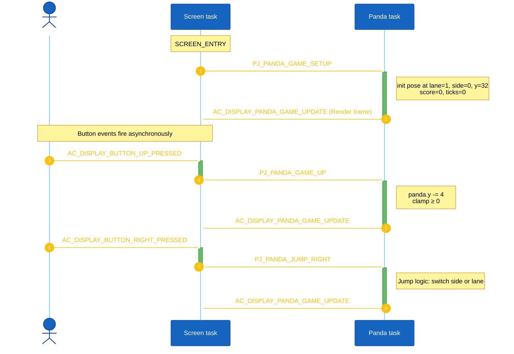
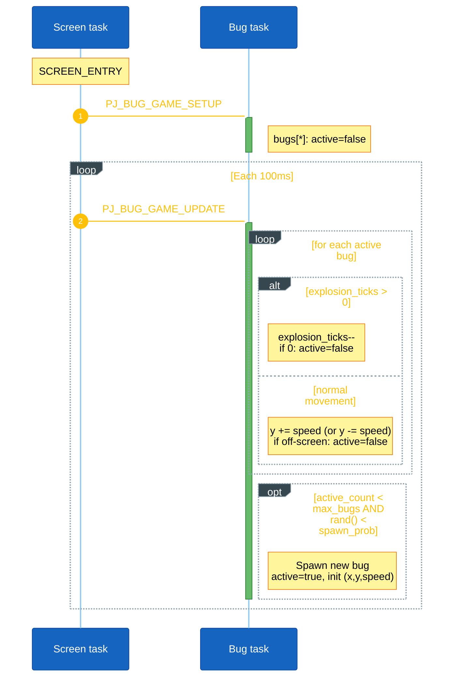
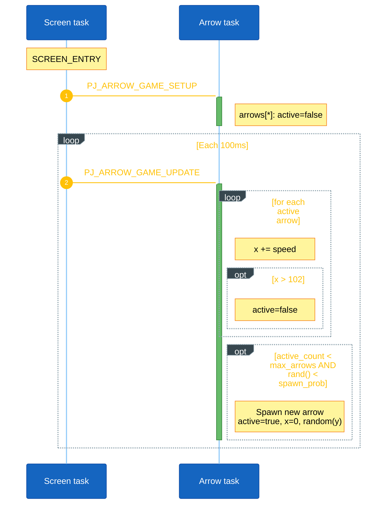
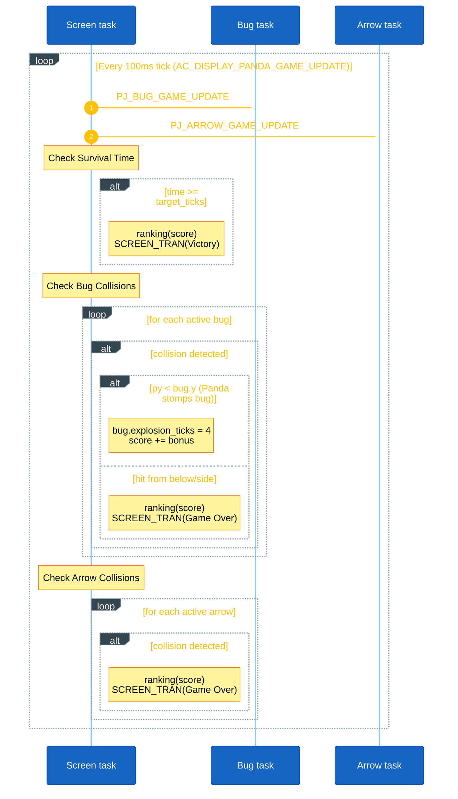

<h1 align="center">Game Object Sequences</h1>

This document describes the runtime sequence of each main object in Panda Jump. Each object is handled by its own AK task and receives signals from the screen task (`scr_panda_game`), button callbacks, or the periodic game tick timer.

## I. Object Summary

| Object | Task ID | Main responsibility |
|---|---|---|
| Panda | `PJ_PANDA_GAME_ID` | Controls the player (Panda) vertical position, bamboo lane, side, score, and survival time. |
| Bug | `PJ_BUG_GAME_ID` | Spawns bugs based on difficulty, moves them vertically along bamboos, and manages explosion animation ticks. |
| Arrow | `PJ_ARROW_GAME_ID` | Spawns and moves arrows horizontally across the screen as an additional hazard. |

The screen task `scr_panda_game` acts as the main coordinator. It posts `AC_DISPLAY_PANDA_GAME_UPDATE` every 100 ms. On each tick, the screen task updates game time, triggers enemy updates, and checks collisions.

## II. Panda Object Sequence

Panda owns the player state (`panda` object).

**Setup.** `PJ_PANDA_GAME_SETUP` places the panda on the middle lane (`lane = 1`), left side (`side = 0`), at `y = AXIS_Y_PANDA`, and resets `score` and `survival_time_ticks`.

**Input.** Button callbacks inside the screen task post signals directly to the Panda task:
- **UP / DOWN:** Posts `PJ_PANDA_GAME_UP` or `PJ_PANDA_GAME_DOWN`. Moves `panda.y` by 4 pixels, clamped to screen boundaries.
- **LEFT / RIGHT:** Posts `PJ_PANDA_JUMP_LEFT` or `PJ_PANDA_JUMP_RIGHT`. If the panda is on the left side of a bamboo, it jumps to the right side of the same bamboo. If it is already on the right side, it jumps to the left side of the adjacent right bamboo.

After any movement, the Panda task posts `AC_DISPLAY_PANDA_GAME_UPDATE` to trigger an immediate frame render.

<strong><em>Figure 1:</em></strong> Panda sequence logic

## III. Bug Object Sequence

Bug owns the `bugs[MAX_BUGS]` array and handles vertical enemies crawling on the bamboos.

**Setup.** `PJ_BUG_GAME_SETUP` clears every slot (`active = false`).

**Per-tick.** Each `PJ_BUG_GAME_UPDATE` the task evaluates active bugs and spawn probabilities:
- Evaluates `game_settings.difficulty` to set `max_bugs`, `speed`, and `spawn_prob`.
- Moves active bugs by `speed` (up or down). If a bug goes off-screen, it is deactivated.
- If a bug's `explosion_ticks > 0`, it counts down the timer until it reaches 0 and then deactivates the bug.
- Randomly rolls against `spawn_prob`. If successful and active count is below `max_bugs`, spawns a new bug on a random bamboo.

<strong><em>Figure 2:</em></strong> Bug sequence logic

## IV. Arrow Object Sequence

Arrow owns the `arrows[MAX_ARROWS]` array and handles projectiles flying horizontally across the screen.

**Setup.** `PJ_ARROW_GAME_SETUP` clears every slot (`active = false`).

**Per-tick.** Each `PJ_ARROW_GAME_UPDATE` evaluates active arrows:
- Moves active arrows right by `speed`.
- Deactivates arrows if they cross the right boundary (`x > 102`).
- Checks difficulty to calculate spawn probability.
- Rolls to spawn a new arrow starting from the left (`x = 0`) at a random vertical `y` coordinate.

<strong><em>Figure 3:</em></strong> Arrow sequence logic

## V. Screen Tick & Collision Sequence

The Screen task (`scr_panda_game`) manages the global game state, time limits, and handles collision detection.

**Per-tick.** Each `AC_DISPLAY_PANDA_GAME_UPDATE` the screen:
1. Posts `PJ_BUG_GAME_UPDATE` and `PJ_ARROW_GAME_UPDATE`.
2. Evaluates the `survival_time_ticks` against the difficulty's time limit (e.g., 60s, 120s). If the limit is reached, it records the score, plays `BUZZER_SOUND_MERRY_CHRISTMAS`, and transitions to the **Victory screen**.
3. Evaluates collisions using AABB bounding boxes (`check_collision`):
    - **Bug Collision:** If the Panda collides with a Bug, it checks relative Y positions. If the Panda is above (`py < bug.y`), the Bug is stomped, its `explosion_ticks` is set, a Click sound is played, and the Panda receives bonus points. If the Panda is below or level, the Panda dies plays a Bang sound, records score, and transitions to the **Game Over screen**.
    - **Arrow Collision:** Any overlap immediately transitions to the **Game Over screen**.

<strong><em>Figure 4:</em></strong> Ticking and Collision sequence

