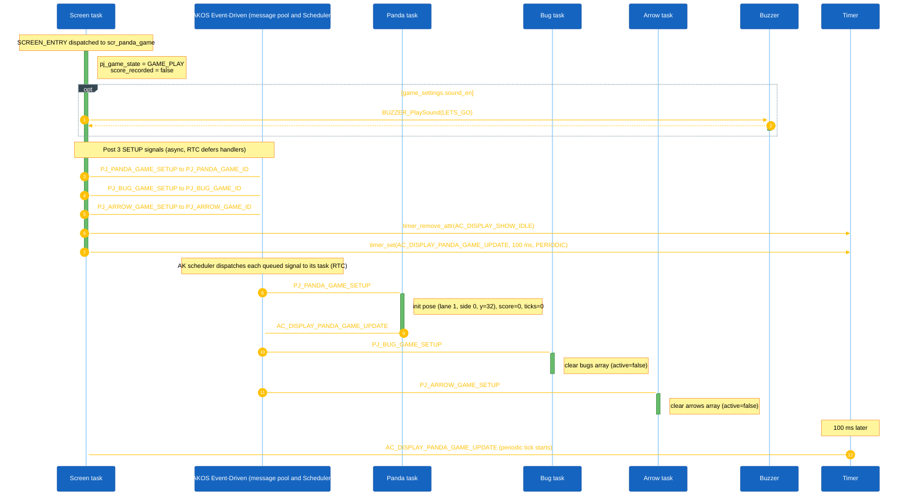
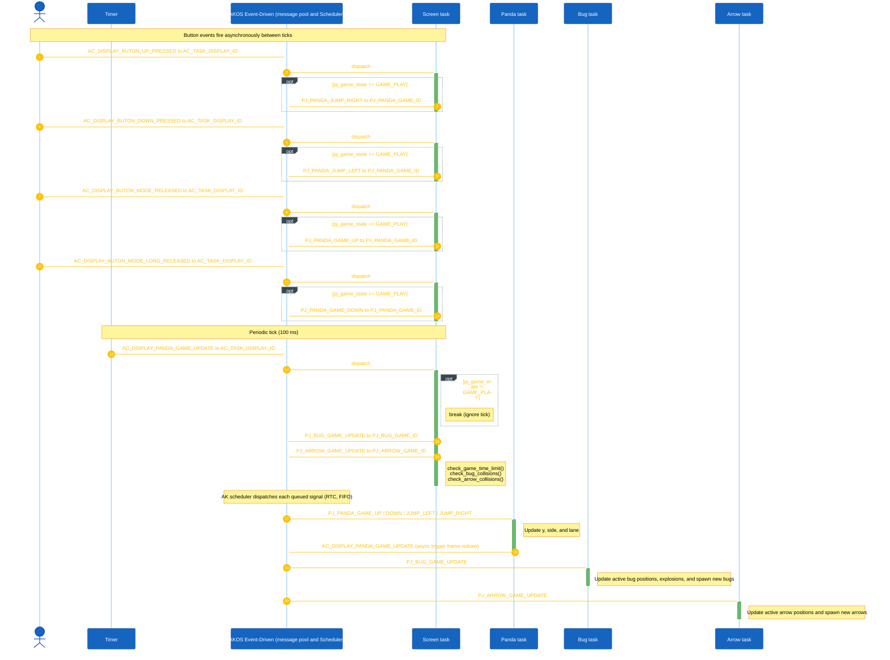

<h1 align="center">Runtime Signal Processing</h1>

This document explains how the Panda Jump game processes button input, task messages, game-loop ticks, and object updates. The game uses the AK event-driven task architecture: each major game object owns a task, receives signals through AK messages, and updates its own state.

## I. Overview

The Panda Jump game is implemented using event-driven tasks.

Each game object owns:

- A dedicated task
- Its own signal handler
- Its own state data
- Its own update logic

The display task (`AC_TASK_DISPLAY_ID`) owns the screen manager and handles screen-level events. During gameplay, the active screen `scr_panda_game` receives the periodic game tick and posts update messages for enemy tasks, as well as handling collision checks.

Input events from hardware buttons are converted into software signals. Button callbacks always post `AC_DISPLAY_BUTON_*` signals to `AC_TASK_DISPLAY_ID`; the active screen handler decides what to do with them. During gameplay, the screen translates UP/DOWN and MODE button actions into Panda movement signals.

The main game loop is driven by a periodic timer signal:

```c
AC_DISPLAY_PANDA_GAME_UPDATE
```

The current game tick interval is:

```c
100 ms
```

Main runtime flow:

1. Button callbacks or timers create software signals.
2. Signals are posted into the AK message pool.
3. The AK scheduler dispatches messages to destination task handlers.
4. Each task updates only the state it owns.
5. The screen render reads the latest object state and refreshes the display buffer.

### High Level Architecture

#### 1. Game Start



<p align="center"><strong><em>Figure 1:</em></strong> Game start sequence logic</p>

#### 2. Game Playing



<p align="center"><strong><em>Figure 2:</em></strong> Gameplay sequence logic</p>

## II. Code References

| Area | File |
|---|---|
| Task IDs and task handlers | `application/sources/app/task_list.h` |
| Task table registration | `application/sources/app/task_list.cpp` |
| Signal definitions | `application/sources/app/app.h` |
| Button callback logic | `application/sources/app/app_bsp.cpp` |
| Main game screen logic | `application/sources/app/screens/scr_panda_game.cpp` |
| Game-over screen logic | `application/sources/app/screens/scr_game_over.cpp` |
| Victory screen logic | `application/sources/app/screens/scr_victory.cpp` |
| Screen manager | `application/sources/common/screen_manager.cpp` |

## III. Task Ownership

| Task | Responsibility | Owns Data | Receives Signals |
|---|---|---|---|
| `AC_TASK_DISPLAY_ID` | Screen manager, render scheduling, button routing, central game collision dispatch | Current screen state, `pj_game_state`, `top_scores[]` | All `AC_DISPLAY_BUTON_*` signals, `AC_DISPLAY_PANDA_GAME_UPDATE` |
| `PJ_PANDA_GAME_ID` | Player control and score keeping | `panda` | `PJ_PANDA_GAME_SETUP`, `PJ_PANDA_GAME_UP`, `PJ_PANDA_GAME_DOWN`, `PJ_PANDA_JUMP_LEFT`, `PJ_PANDA_JUMP_RIGHT` |
| `PJ_BUG_GAME_ID` | Vertical enemy movement, explosion ticks, and spawn rate | `bugs[]` | `PJ_BUG_GAME_SETUP`, `PJ_BUG_GAME_UPDATE` |
| `PJ_ARROW_GAME_ID` | Horizontal projectile movement and spawn rate | `arrows[]` | `PJ_ARROW_GAME_SETUP`, `PJ_ARROW_GAME_UPDATE` |

## IV. Button Event Processing

In Panda Jump, button callbacks always post `AC_DISPLAY_BUTON_*` signals to `AC_TASK_DISPLAY_ID`. The currently active screen handler then decides what to do with them. The gameplay screen (`scr_panda_game`) handles those signals locally; it does not require the BSP to know which screen is active.

### Button Processing Rules

| Button | BSP posts to AK | Active screen | Result inside the screen handler |
|---|---|---|---|
| UP Pressed | `AC_DISPLAY_BUTON_UP_PRESSED` → `AC_TASK_DISPLAY_ID` | `scr_panda_game` | If `pj_game_state == GAME_PLAY`: post `PJ_PANDA_JUMP_RIGHT` to `PJ_PANDA_GAME_ID` |
| DOWN Pressed | `AC_DISPLAY_BUTON_DOWN_PRESSED` → `AC_TASK_DISPLAY_ID` | `scr_panda_game` | If `pj_game_state == GAME_PLAY`: post `PJ_PANDA_JUMP_LEFT` to `PJ_PANDA_GAME_ID` |
| MODE Released | `AC_DISPLAY_BUTON_MODE_RELEASED` → `AC_TASK_DISPLAY_ID` | `scr_panda_game` | If `pj_game_state == GAME_PLAY`: post `PJ_PANDA_GAME_UP` to `PJ_PANDA_GAME_ID` |
| MODE Long Released | `AC_DISPLAY_BUTON_MODE_LONG_RELEASED` → `AC_TASK_DISPLAY_ID` | `scr_panda_game` | If `pj_game_state == GAME_PLAY`: post `PJ_PANDA_GAME_DOWN` to `PJ_PANDA_GAME_ID` |

Note: The hardware UP button translates to a rightward jump, and the DOWN button translates to a leftward jump. Movement up and down the bamboo is managed by short and long releases of the MODE button.
